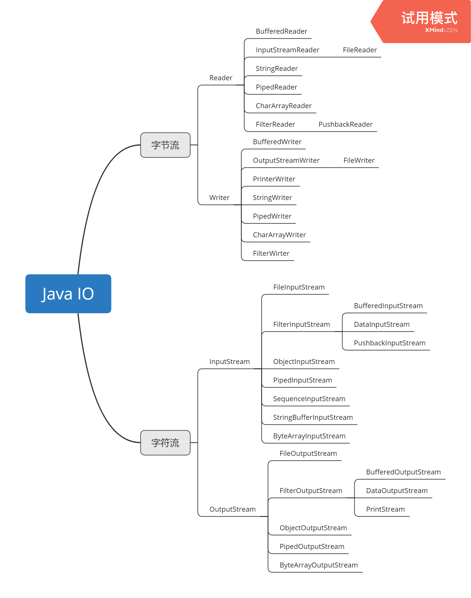

# JAVA IO
## 常见父类(均为抽象类)  
|类名|简介|
|:---:|:---:|
|[InputStream](#InputStream)|这个抽象类是表示输入字节流的所有类的父类|
|[OutputStream](#OutputStream)|这个抽象类是表示字节输出流的所有类的父类|
|[Reader](#Reader)|用于读取字符流的抽象类|
|[Writer](#Writer)|用于写出字符流的抽象类|

## 常用类
|类名|简介|
|:---:|:---:|
|[File](#File)|文件和目录路径名的抽象表示|
|[FileInputStream](#FileInputStream)|获取文件的字节|
|[FileOutputStream](#FileOutputStream)|将字节写入文件|
|[FileReader](#FileReader)|以字符的形式读取文件|
|[FileWriter](#FileWriter)|以字符的形式写入文件|
|[BufferedInputStream](#BufferedInputStream)|带有缓冲区的字节输入流|
|[BufferedOutputStream](#BufferedOutputStream)|带有缓冲区的字节输出流|
|[BufferedReader](#BufferedReader)|带有缓冲区的字符输入流|
|[BufferedWriter](#BufferedWriter)|带有缓冲区的字符输出流|
|[InputStreamReader](#InputStreamReader)|它读取字节，并使用指定的charset将其解码为字符|
|[OutputStreamReader](#OutputStreamReader)|向其写入的字符编码成使用指定的字节charset|

## 相关图片
- [分类](#分类)
- [继承关系](#继承关系)

---
## InputStream
API  
>https://docs.oracle.com/en/java/javase/12/docs/api/java.base/java/io/InputStream.html

继承该类需要重写  
- read()

所有方法
-	available()  
返回从该输入流中可以读取（或跳过）的字节数的估计值，而不会被下一次调用此输入流的方法阻塞。
-	close()  
关闭此输入流并释放与流相关联的任何系统资源。
-	mark(int readlimit)  
标记此输入流中的当前位置。
-	markSupported()  
测试这个输入流是否支持 mark和 reset方法。
-	read(byte[] b)  
从输入流读取一些字节数，并将它们存储到缓冲区 b 。
-	read(byte[] b, int off, int len)  
从输入流读取最多 len字节的数据到一个字节数组。
-	reset()  
将此流重新定位到上次在此输入流上调用 mark方法时的位置。
-	skip(long n)  
跳过并丢弃来自此输入流的 n字节数据。
-   abstract int	read()  
从输入流读取数据的下一个字节。

## OutputStream
API  
>https://docs.oracle.com/en/java/javase/12/docs/api/java.base/java/io/OutputStream.html

继承该类需要重写  
- write()

所有方法
-	close()  
关闭此输出流并释放与此流相关联的任何系统资源。
-	flush()  
刷新此输出流并强制任何缓冲的输出字节被写出。
-	write(byte[] b)  
将 b.length字节从指定的字节数组写入此输出流。
-	write(byte[] b, int off, int len)  
从指定的字节数组写入 len个字节，从偏移 off开始输出到此输出流。
-   abstract void	write(int b)  
将指定的字节写入此输出流。

## Reader
API  
>https://docs.oracle.com/en/java/javase/12/docs/api/java.base/java/io/Reader.html

继承该类需要重写  
- read(char[] cbuf, int off, int len)  
- close()  

所有方法

-   mark(int readAheadLimit)  
标记流中的当前位置。
-	markSupported()  
告诉这个流是否支持mark（）操作。
-	read()  
读一个字符
-	read(char[] cbuf)  
将字符读入数组。
-	read(CharBuffer target)  
尝试将字符读入指定的字符缓冲区。
-	ready()  
告诉这个流是否准备好被读取。
-	reset()  
重置流。
-	skip(long n)  
跳过字符
-   abstract int	read(char[] cbuf, int off, int len)  
将字符读入数组的一部分。  
-   abstract void	close()  
关闭流并释放与之相关联的任何系统资源。

## Writer
API  
>https://docs.oracle.com/en/java/javase/12/docs/api/java.base/java/io/Writer.html

继承该类需要重写  
- write(char[] cbuf, int off, int len)  
- flush()

所有方法
-	append(char c)
将指定的字符附加到此作者。
-	append(CharSequence csq)
将指定的字符序列附加到此作者。
-	append(CharSequence csq, int start, int end)
将指定字符序列的子序列附加到此作者。
-	write(char[] cbuf)
写入一个字符数组。
-	write(int c)
写一个字符
-	write(String str)
写一个字符串
-	write(String str, int off, int len)
写一个字符串的一部分。
-   abstract void	write(char[] cbuf, int off, int len)
写入字符数组的一部分。
-   abstract void	close()
关闭流，先刷新。
-   abstract void	flush()
刷新流。 

## File
API  
>https://docs.oracle.com/en/java/javase/12/docs/api/java.base/java/io/File.html

构造方法
- File(File parent, String child)  
从父抽象路径名和子路径名字符串创建新的 File实例。
- File(String pathname)  
通过将给定的路径名字符串转换为抽象路径名来创建新的 File实例。
- File(String parent, String child)  
从父路径名字符串和子路径名字符串创建新的 File实例。
- File(URI uri)  
通过将给定的 file: URI转换为抽象路径名来创建新的 File实例。  

常用方法
-   createNewFile()  
当且仅当具有该名称的文件尚不存在时，原子地创建一个由该抽象路径名命名的新的空文件。
-   delete()  
删除由此抽象路径名表示的文件或目录。
-   getAbsoluteFile()  
返回此抽象路径名的绝对形式。
-   getAbsolutePath()  
返回此抽象路径名的绝对路径名字符串。
-   getName()  
返回由此抽象路径名表示的文件或目录的名称。
- 	getParent()  
返回此抽象路径名的父 null的路径名字符串，如果此路径名未命名为父目录，则返回null。
- 	isDirectory()  
测试此抽象路径名表示的文件是否为目录。 
- 	isFile()  
测试此抽象路径名表示的文件是否为普通文件。
- 	lastModified()  
返回此抽象路径名表示的文件上次修改的时间。
- 	listFiles()  
返回一个抽象路径名数组，表示由该抽象路径名表示的目录中的文件。
- 	mkdir()  
创建由此抽象路径名命名的目录。
- 	mkdirs()  
创建由此抽象路径名命名的目录，包括任何必需但不存在的父目录。
- 	renameTo(File dest)  
重命名由此抽象路径名表示的文件。

## FileInputStream
API  
> https://docs.oracle.com/en/java/javase/12/docs/api/java.base/java/io/FileInputStream.html  

构造方法  
- FileInputStream(File file)  
通过打开与实际文件的连接创建一个 FileInputStream ，该文件由文件系统中的 File对象 file命名。
- FileInputStream(FileDescriptor fdObj)  
创建 FileInputStream通过使用文件描述符 fdObj ，其表示在文件系统中的现有连接到一个实际的文件。
- FileInputStream(String name)  
通过打开与实际文件的连接来创建一个 FileInputStream ，该文件由文件系统中的路径名 name命名。  

常用方法
- 	close()  
关闭此文件输入流并释放与流相关联的任何系统资源。
- 	read()  
从该输入流读取一个字节的数据。
- 	read(byte[] b)  
从该输入流读取最多 b.length个字节的数据为字节数组。
-	read(byte[] b, int off, int len)  
从该输入流读取最多 len字节的数据为字节数组。

## FileOutputStream
API  
> https://docs.oracle.com/en/java/javase/12/docs/api/java.base/java/io/FileOutputStream.html  

构造方法  
- FilterOutputStream(OutputStream out)  
创建一个基于指定底层输出流的输出流过滤器。  

常用方法  
- 	close()  
关闭此输出流并释放与流相关联的任何系统资源。
- flush()  
刷新此输出流，并强制将任何缓冲的输出字节写入流。
- write(byte[] b)  
将 b.length个字节写入此输出流。
- 	write(byte[] b, int off, int len)  
将 len字节从位于偏移量 off的指定 byte阵列写入此输出流。

## FileReader
API  
> https://docs.oracle.com/en/java/javase/12/docs/api/java.base/java/io/FileReader.html

构造方法  
- FileReader(File file)  
创建一个新的 FileReader ，给出 File读取。
- FileReader(FileDescriptor fd)  
创建一个新的 FileReader ，给定 FileDescriptor读取。
- FileReader(String fileName)  
创建一个新的 FileReader ，给定要读取的文件的名称。

常用方法
- 该类继承于InputStreamReader,没有重写的父类方法。
- [查看InputStreamReader](#InputStreamReader)

## FileWriter
API  
> https://docs.oracle.com/en/java/javase/12/docs/api/java.base/java/io/FileWriter.html

构造方法
- FileWriter(File file)  
给一个File对象构造一个FileWriter对象。
- FileWriter(File file, boolean append)  
给一个File对象构造一个FileWriter对象。
- FileWriter(FileDescriptor fd)  
构造与文件描述符关联的FileWriter对象。
- FileWriter(String fileName)  
构造一个给定文件名的FileWriter对象。
- FileWriter(String fileName, boolean append)  
构造一个FileWriter对象，给出一个带有布尔值的文件名，表示是否附加写入的数据。

常用方法
- 该类继承于OutputStreamWriter,没有重写的父类方法。
- [查看OutputStreamWriter](#OutputStreamWriter)

## BufferedInputStream
API  
> https://docs.oracle.com/en/java/javase/12/docs/api/java.base/java/io/BufferedInputStream.html  

构造方法
- BufferedInputStream(InputStream in)  
创建一个 BufferedInputStream并保存其参数，输入流 in ，供以后使用。
- BufferedInputStream(InputStream in, int size)  
创建 BufferedInputStream具有指定缓冲区大小，并保存其参数，输入流 in ，供以后使用。

常用方法  
-   close()  
关闭此输入流并释放与流相关联的任何系统资源。
-	read(byte[] b, int off, int len)  
从给定的偏移开始，将字节输入流中的字节读入指定的字节数组。
-	read()  
从输入流读取数据的下一个字节。
- 	mark(int readlimit)  
标记此输入流中的当前位置。 
-	reset()  
将此流重新定位到上次在此输入流上调用 mark方法时的位置。
- markSupported()  
测试这个输入流是否支持 mark和 reset方法。

## BufferedOutputStream
API  
> https://docs.oracle.com/en/java/javase/12/docs/api/java.base/java/io/BufferedOutputStream.html   

构造方法    
- ufferedOutputStream(OutputStream out)  
创建一个新的缓冲输出流，以将数据写入指定的底层输出流。
- BufferedOutputStream(OutputStream out, int size)  
创建一个新的缓冲输出流，以便以指定的缓冲区大小将数据写入指定的底层输出流。

常用方法
-	flush()  
刷新缓冲输出流。  
-	write(byte[] b, int off, int len)  
从指定的字节数组写入 len个字节，从偏移 off开始到缓冲的输出流。  
-	write(int b)  
将指定的字节写入缓冲的输出流。

## BufferedReader
API  
> https://docs.oracle.com/en/java/javase/12/docs/api/java.base/java/io/BufferedReader.html

构造方法
- BufferedReader(Reader in)  
创建使用默认大小的输入缓冲区的缓冲字符输入流。
- BufferedReader(Reader in, int sz)  
创建使用指定大小的输入缓冲区的缓冲字符输入流。

常用方法
-	close()  
关闭流并释放与之相关联的任何系统资源。
-	read()  
读一个字符
-	read(char[] cbuf, int off, int len)  
将字符读入数组的一部分。
-   readLine()  
读一行文字。

## BufferedWriter
API  
> https://docs.oracle.com/en/java/javase/12/docs/api/java.base/java/io/BufferedWriter.html

构造方法
- BufferedWriter(Writer out)  
创建使用默认大小的输出缓冲区的缓冲字符输出流。
- BufferedWriter(Writer out, int sz)  
创建一个新的缓冲字符输出流，使用给定大小的输出缓冲区。

常用方法
-	close()  
关闭流，先刷新。
-	flush()  
刷新流。
-	newLine()  
写一行行分隔符。
-	write(char[] cbuf, int off, int len)  
写入字符数组的一部分。
-	write(int c)  
写一个字符
-	write(String s, int off, int len)  
写一个字符串的一部分。

## InputStreamReader  
API  
> https://docs.oracle.com/en/java/javase/12/docs/api/java.base/java/io/InputStreamReader.html

构造方法
- InputStreamReader(InputStream in)  
创建一个使用默认字符集的InputStreamReader。
- InputStreamReader(InputStream in, Charset cs)  
创建一个使用给定字符集的InputStreamReader。
- InputStreamReader(InputStream in, CharsetDecoder dec)  
创建一个使用给定字符集解码器的InputStreamReader。
- InputStreamReader(InputStream in, String charsetName)  
创建一个使用命名字符集的InputStreamReader。

常用方法
-	close()  
关闭流并释放与之相关联的任何系统资源。
-	getEncoding()  
返回此流使用的字符编码的名称。
-	read()  
读一个字符
-	read(char[] cbuf, int offset, int length)  
将字符读入数组的一部分。
-	ready()  
告诉这个流是否准备好被读取。

## OutputStreamWriter
API  
> https://docs.oracle.com/en/java/javase/12/docs/api/java.base/java/io/OutputStreamWriter.html

构造方法
- OutputStreamWriter(OutputStream out)  
创建一个使用默认字符编码的OutputStreamWriter。
- OutputStreamWriter(OutputStream out, Charset cs)  
创建一个使用给定字符集的OutputStreamWriter。
- OutputStreamWriter(OutputStream out, CharsetEncoder enc)  
创建一个使用给定字符集编码器的OutputStreamWriter。
- OutputStreamWriter(OutputStream out, String charsetName)  
创建一个使用命名字符集的OutputStreamWriter。

常用方法
-	close()  
关闭流，先刷新。
-	flush()  
刷新流。
-	getEncoding()  
返回此流使用的字符编码的名称。
-	write(char[] cbuf, int off, int len)  
写入字符数组的一部分。
-	write(int c)  
写一个字符
-	write(String str, int off, int len)  
写一个字符串的一部分。

---
## 分类

## 继承关系
