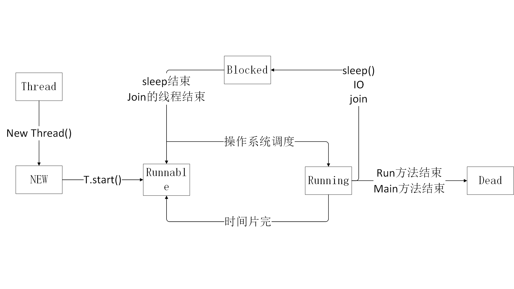

# JAVA 多线程
- [JAVA 多线程](#JAVA-%E5%A4%9A%E7%BA%BF%E7%A8%8B)
  - [多线程·基础](#%E5%A4%9A%E7%BA%BF%E7%A8%8B%E5%9F%BA%E7%A1%80)
    - [多线程的实现方式](#%E5%A4%9A%E7%BA%BF%E7%A8%8B%E7%9A%84%E5%AE%9E%E7%8E%B0%E6%96%B9%E5%BC%8F)
    - [线程状态](#%E7%BA%BF%E7%A8%8B%E7%8A%B6%E6%80%81)
    - [线程调度](#%E7%BA%BF%E7%A8%8B%E8%B0%83%E5%BA%A6)
    - [线程类的常用方法](#%E7%BA%BF%E7%A8%8B%E7%B1%BB%E7%9A%84%E5%B8%B8%E7%94%A8%E6%96%B9%E6%B3%95)
    - [线程同步](#%E7%BA%BF%E7%A8%8B%E5%90%8C%E6%AD%A5)

---
## 多线程·基础
### 多线程的实现方式
- 继承Thread类并重写run方法  
  ```
  class MyThread extends Thread {
     
      /*
        重写run方法
      */
      public void run() {
          //具体实现
      }

  }
  ```
    使用线程时只需要调用MyThread实例对象的start方法  
    `new MyThread().start()`

- 实现Runnable接口  
  ```
      class MyThread implements Runnable {
     
      /*
        重写run方法
      */
      public void run() {
          //具体实现
      }

  }
  ```
  使用线程时需要new一个Thread对象并传入MyThread实例对象并调用start方法  
  `new Thread(new MyThread()).start()`  

### 线程状态


### 线程调度
- sleep(long millis)   
  使线程休眠millis毫秒，不释放锁
- wait()  
  使线程休眠，释放锁，等待别的线程调用notify或notifyAll唤醒
- yield()  
  通知操作系统暂停该进程并调度别的优先级不低于该线程的线程
- join  
  保证该线程的父线程在该线程之后结束
- notify()    
  唤醒某个wait的线程
- notifyAll()   
  通知操作系统唤醒所有wait的线程，并由操作系统选择一个线程运行 

### 线程类的常用方法
- sleep(): 强迫一个线程睡眠Ｎ毫秒。   
- isAlive(): 判断一个线程是否存活。   
- join(): 等待线程终止。   
- activeCount(): 程序中活跃的线程数。   
- enumerate(): 枚举程序中的线程。   
- currentThread(): 得到当前线程。   
- isDaemon(): 一个线程是否为守护线程。   
- setDaemon(): 设置一个线程为守护线程。(用户线程和守护线程的区别在于，是否等待主线程依赖于主线程结束而结束)   
- setName(): 为线程设置一个名称。
- wait(): 强迫一个线程等待。   
- notify(): 通知一个线程继续运行。   
- setPriority(): 设置一个线程的优先级。  

### 线程同步  
为了避免两个线程对同一个对象进行操作引起的数据错误，java中使用synchronized关键字进行标记。当某个线程使用带有synchronized标记的对象时，别的进程就无法获得该对象的使用权。操作系统将该线程放入同步阻塞池，等待该对象被释放。  
synchronized关键字可以标记类的实例方法，也可以在方法中标记某个成员，当某个线程获得某个对象synchronized标记的方法时，别的线程不能再获得该对象其余synchronized标记的方法。
- 例1  
  ```
    
  ```